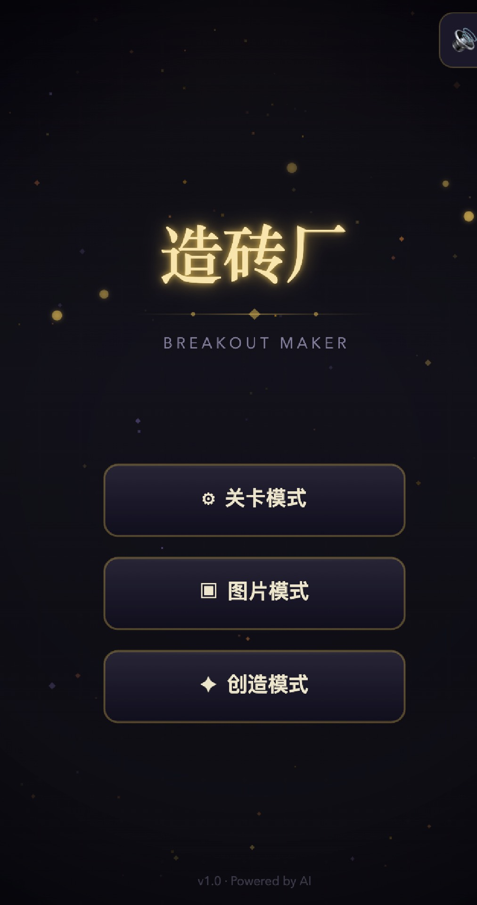
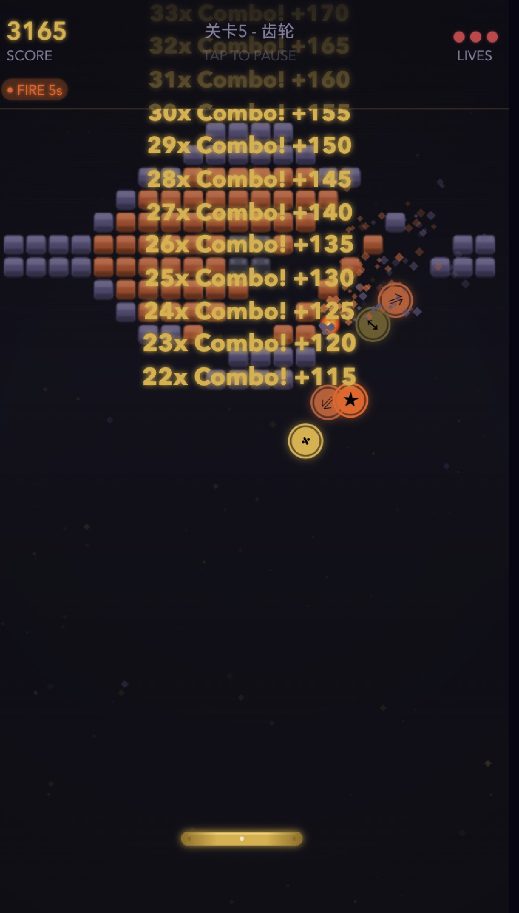
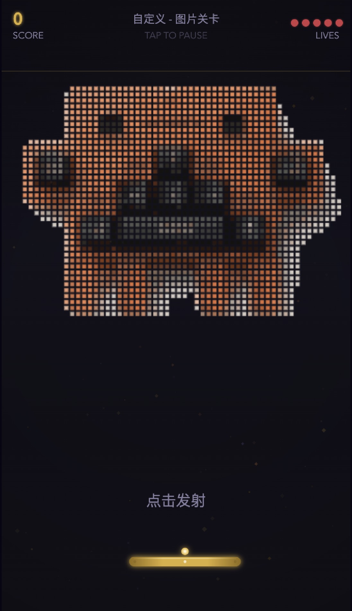
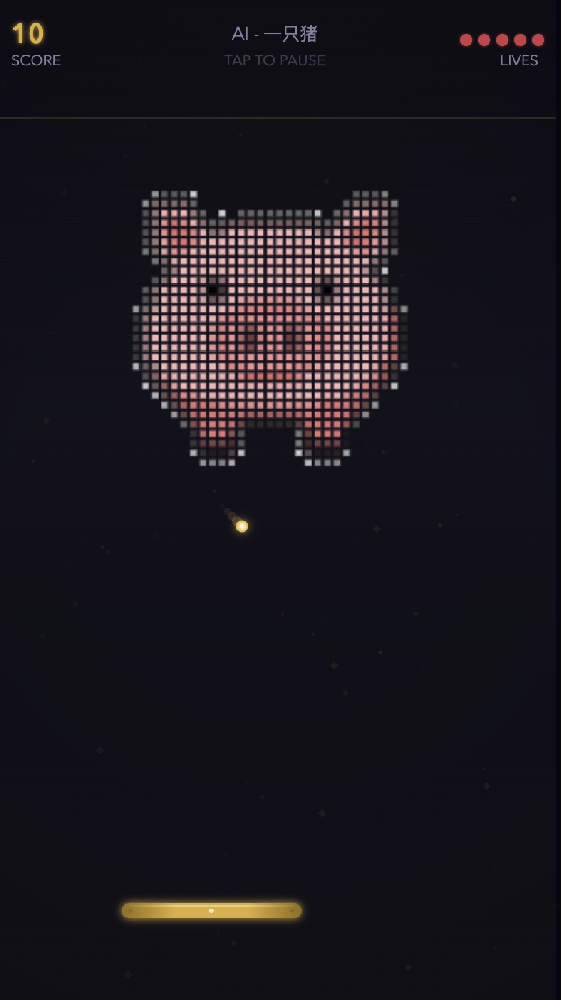

# Breakout Maker - 造砖厂

一款 AI 驱动的打砖块游戏。用自然语言描述你想要的图案，AI 为你铸造独一无二的关卡；或者上传一张图片，自动生成像素风砖块关卡。

<p align="center">
  
  
  
  
</p>

## Features

- **关卡模式** — 13 个精心设计的内置关卡，从"初次见面"到"最终 BOSS"，逐步提升难度
- **图片模式** — 上传任意图片，通过中值切割算法自动提取主色调，生成像素风砖块关卡
- **创造模式** — 输入一段自然语言描述（如"一只猪"、"城堡"、"星空"），AI 实时生成对应图案的关卡
- **道具系统** — 5 种随机掉落道具：分裂球、多重发射、火球穿透、加宽挡板、额外生命
- **连击系统** — Combo 连击倍率加分，追求高分的乐趣
- **星界熔铸主题** — 深邃的午夜靛蓝配熔金与铜色，天文台般的视觉风格

## Tech Stack

**前端** — 纯 Canvas 2D 渲染，零依赖，固定时间步长物理引擎

**后端** — Express + TypeScript，调用 LLM 进行关卡生成，支持模板匹配快速路径与 AI 图像生成

## Project Structure

```
breakout-maker/
├── src/                    # 游戏前端源码
│   ├── entities/           # 球、挡板、砖块、粒子等实体
│   ├── physics/            # 碰撞检测与物理世界
│   ├── scenes/             # 场景状态机（菜单、关卡选择、游戏、创造模式等）
│   ├── rendering/          # Canvas 渲染器
│   ├── audio/              # 音效管理
│   ├── image/              # 图片转砖块（中值切割算法）
│   ├── systems/            # 计分系统
│   ├── input/              # 输入管理（触屏 + 鼠标）
│   ├── constants.js        # 游戏常量与主题配色
│   ├── power-ups.js        # 道具定义
│   └── game.js             # 游戏主循环
├── levels/                 # 13 个关卡 JSON 数据
├── server/                 # AI 关卡生成后端
│   └── src/
│       ├── index.ts        # Express 服务入口
│       ├── generate-level.ts  # 关卡生成（模板匹配 + AI）
│       └── generate-image.ts  # AI 图像生成
├── build.js                # 构建脚本，将源码打包为 preview.html
├── preview.html            # 构建产物，可直接在浏览器运行
└── test/                   # 测试
```

## Quick Start

### 1. 构建前端预览

```bash
node build.js
open preview.html
```

### 2. 启动 AI 关卡生成服务（可选，创造模式需要）

```bash
cd server
npm install

# 配置环境变量
cp .env.example .env
# 编辑 .env，填入你的 LLM_API_KEY

npm run dev
```

服务将运行在 `http://localhost:3001`。

## How to Play

1. **关卡模式** — 选择关卡，滑动挡板弹球消灭所有砖块
2. **图片模式** — 上传一张图片，自动转换为像素砖块关卡来玩
3. **创造模式** — 输入描述或点击快捷标签，AI 为你生成关卡

## License

MIT
