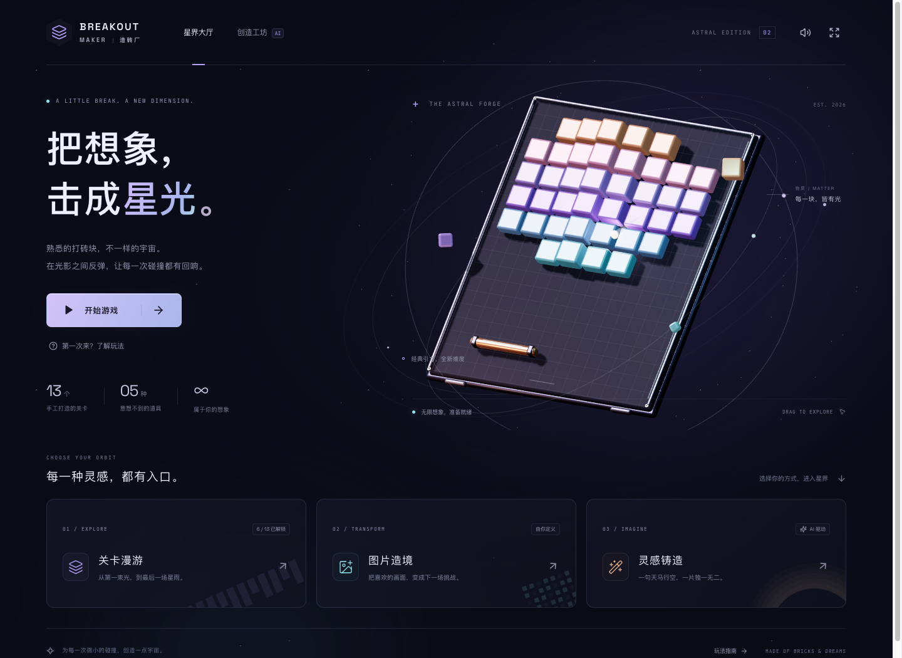
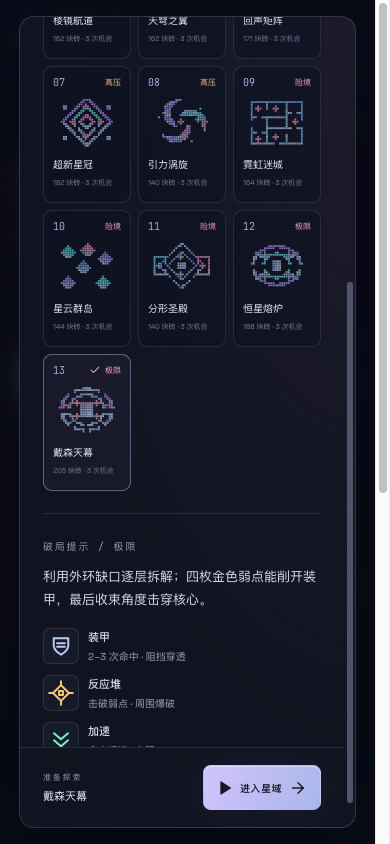
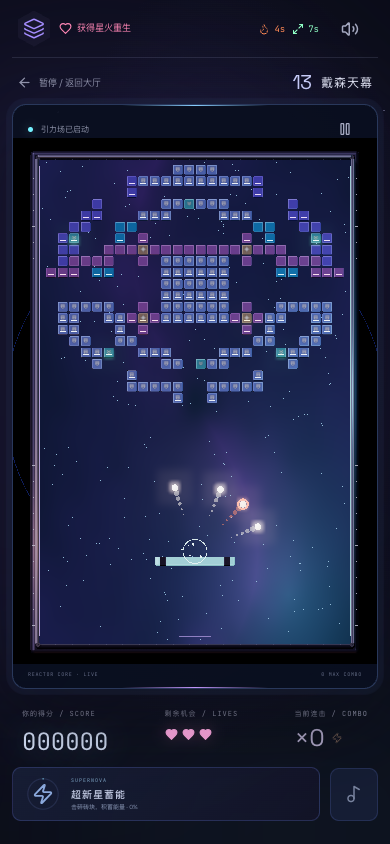

# ASTRAL FORGE · 造砖厂

**Breakout Maker — a dimensional edition.**

[在线体验 · Play now](https://luyao.blog/games/breakout/) · [服务器部署与回滚](deploy/COHOST.md)

[简体中文](#简体中文) | [English](#english)



## 简体中文

### 超新星街机版



- **全新星图关卡**：前12关围绕入口与弱点重做，涵盖星环、双子反应堆、矩阵、涡旋、迷宫与分形圣殿；第13关保留原始「鹿原加油 / 必胜」文字砖阵，作为送给鹿原的彩蛋。全部关卡从开始即可任选，旧存档不会锁关。
- **手机清晰视野**：拾取提示、连击和道具倒计时统一显示在页面最上方的导航栏，所有屏幕都不再在球场中显示文字弹层或拾取爆发光圈。



- **主动技能**：击碎砖块积蓄能量，满格后按 **E**（手机点击底部按钮）释放超新星，朝挡板上方最近的外层砖冲击，最多直接命中 5 块、每块 1 点伤害；反应堆弱点会额外爆破近邻。技能不再附赠火球，冲击不会回充能量。
- **掉落节奏**：自然击碎有 7% 概率掉落，连续 18 次未掉落触发保底（仍受 5 秒冷却与最多 2 个在场补给限制）；取消吸附，接球与抢补给需要取舍。
- **视听反馈**：星云球场、发光晶体、冲击波、碎片、道具轨道光环、连击提示和空间音效；可选星际电台默认关闭。
- **稳定运行**：多球上限 4，声音并发上限 48；暂停会冻结技能和道具计时并停止声音。


在星空中的立体球场里打砖块。新版以 React 19、Three.js 和 React Three Fiber 重建界面与 3D 渲染，把梦幻星尘、发光砖块与工业仪器般的操作面板融为一体。

原有玩法继续保留：13 个内置关卡、图片转砖块、AI 创造关卡，以及连击计分、生命和五种道具；全部关卡从一开始即可自由选择。3D 场景呈现原有平面打砖块规则；球、挡板、碰撞和计分复用原游戏逻辑。

### 本地运行

需要 **Node.js 22.12 或更新的 22.x 版本**。

```bash
npm install
npm run dev
```

打开 [http://localhost:5173](http://localhost:5173)。内置关卡和图片模式无需 AI 服务；上传的图片在浏览器中转换为砖块。

```bash
npm run build      # 类型检查并生成 dist/
npm run preview    # 预览生产构建，默认 http://localhost:4173
npm test           # 原有回归测试 + Vitest 测试
npm run test:legacy
```

`predev` 和 `build` 会自动执行 `web/game/build-legacy.cjs`，把 `src/` 的共享游戏逻辑与 `levels/` 的关卡数据组合成前端可导入的模块。不要手动修改生成的 `web/game/legacy.js`。

### 三种模式与操作

- **关卡模式**：自由选择任意关卡，控制挡板反弹小球，清除砖块并推进到下一关。
- **图片模式**：选择本地图片，以原有中值切割配色和砖块映射算法生成关卡。
- **创造模式**：输入图案描述，调用 AI 服务生成关卡；常见图案可以命中服务端模板。
- **控制挡板**：在球场内移动鼠标或拖动手指，也可使用方向键或 `A` / `D`。
- **发球与暂停**：点击球场或按空格发球，`Esc` / `P` 暂停或继续，也可使用界面按钮；球掉落后消耗生命并重新发球。
- **道具**：分裂与齐射各增加两球；火球仅强化一球，限 4 秒或 6 次碰砖；加宽 25% 持续 7 秒；每局最多修复一次生命，不超过初始生命。连击得分倍率最高 4 倍。

### AI 服务配置（可选）

在第二个终端中启动原有 Express 服务：

```bash
cd server
npm install
cp .env.example .env
# 编辑 .env，填入 API 配置
npm run dev
```

| 环境变量 | 用途 |
| --- | --- |
| `LLM_API_KEY` | 服务启动必填；同时作为默认图像生成 API 密钥 |
| `IMAGE_API_KEY` | 可选的独立图像生成 API 密钥 |
| `IMAGE_API_URL` | 图像生成接口，默认 `https://api.siliconflow.cn/v1/images/generations` |
| `IMAGE_MODEL` | 图像模型，默认 `Qwen/Qwen-Image` |
| `PORT` | 服务端口，默认 `3001` |

开发服务器会把 `/api` 请求转发到 [http://localhost:3001](http://localhost:3001)。生产环境需要将 `/api` 路由到 AI 服务，或使用下方 Docker 镜像在同一服务上提供前端与 API。`npm run preview` 主要用于检查构建后的前端。

### 生产构建与 Docker

`dist/` 可以部署到静态站点托管服务。Dockerfile 使用 Node.js 22 分别构建前端和后端，将完整的 `dist/` 复制到 Express 已有的 `public/` 静态目录。

```bash
docker build -t breakout-maker .
docker run --rm --env-file server/.env -p 3001:3001 breakout-maker
```

Docker 运行原有 AI 服务，因此也需要配置 `LLM_API_KEY`。浏览器访问 [http://localhost:3001](http://localhost:3001)。仓库已有的 `docker-compose.yml` 和 `deploy/` 仍提供原部署入口。

### 项目结构

```text
web/                       React 界面、Three.js 场景与游戏适配层
  game/build-legacy.cjs    共享原有游戏逻辑的生成脚本
src/                       原有物理、实体、计分、音效与图片转换逻辑
levels/                    13 个战术关卡 JSON
public/                    前端静态资源
server/                    Express + TypeScript AI 关卡服务
test/                      原有游戏回归测试
vite.config.ts             开发服务、API 代理与生产打包配置
dist/                      新版生产构建产物（npm run build）
build.js                   原版 Canvas 游戏构建脚本
```

原版单文件 Canvas 预览仍可独立生成：

```bash
node build.js
open preview.html
```

`preview.html` 是旧版界面；新版请使用 `npm run dev` 或 `npm run build`。

## English

### Supernova arcade edition

Destroy bricks to charge **Supernova**, then aim with the paddle and press **E** or tap the mobile skill button. It damages up to five exposed bricks by one HP each; a destroyed reactor splashes the eight neighboring cells without cascading. Armor reflects fireballs; accelerator bricks raise the striking ball’s speed up to 130%. Split and multishot add two ordinary balls with a four-ball cap. Fire strengthens one ball for four seconds or six contacts; wide paddle lasts seven seconds; one life repair is allowed per run. Drops have a five-second cooldown, two-drop limit and 18-kill pity. All 13 stages remain open. Pause freezes effect timers and silences audio.


A brick-breaker set on a three-dimensional court in a field of stars. This edition rebuilds the interface and rendering with React 19, Three.js, and React Three Fiber, pairing luminous bricks and atmospheric particles with precise instrument-style controls.

The original game remains intact: 13 built-in levels, image-to-brick conversion, AI-generated levels, combos, lives, level progression, and five power-ups. The 3D scene visualizes the original planar brick-breaking rules; ball movement, paddle behavior, collisions, and scoring reuse the existing game logic.

### Run locally

Requires **Node.js 22.12 or a newer 22.x release**.

```bash
npm install
npm run dev
```

Open [http://localhost:5173](http://localhost:5173). Built-in levels and image mode work without the AI server. Uploaded images are converted to bricks locally in the browser.

```bash
npm run build      # Type-check and build dist/
npm run preview    # Preview the build, normally at http://localhost:4173
npm test           # Original regression suite and Vitest tests
npm run test:legacy
```

`predev` and `build` automatically run `web/game/build-legacy.cjs`. It packages the shared logic in `src/` and the level data in `levels/` into an importable module. Do not edit the generated `web/game/legacy.js` directly.

### Modes and controls

- **Level mode:** select any level freely, bounce the ball with your paddle, and clear the bricks to progress.
- **Image mode:** choose a local image and convert it into a level using the original median-cut palette and brick-mapping algorithms.
- **Create mode:** describe a pattern and request a level from the AI server; common patterns can use server-side templates.
- **Move:** move your mouse or drag a finger across the court, or use the arrow keys / `A` and `D`.
- **Launch and pause:** click the court or press Space to launch; use `Esc` / `P` or the interface controls to pause and resume. Losing the ball costs a life and lets you serve again.
- **Power-ups:** split ball, multi-shot, piercing fireball, wider paddle, and extra life. Consecutive hits increase the combo multiplier.

### Optional AI server

Start the existing Express service in a second terminal:

```bash
cd server
npm install
cp .env.example .env
# Edit .env with your API configuration
npm run dev
```

| Environment variable | Purpose |
| --- | --- |
| `LLM_API_KEY` | Required by the server at startup; also the default image-generation API key |
| `IMAGE_API_KEY` | Optional separate image-generation API key |
| `IMAGE_API_URL` | Image endpoint; defaults to `https://api.siliconflow.cn/v1/images/generations` |
| `IMAGE_MODEL` | Image model; defaults to `Qwen/Qwen-Image` |
| `PORT` | Server port; defaults to `3001` |

Vite forwards development `/api` requests to [http://localhost:3001](http://localhost:3001). In production, route `/api` to the AI server or use the Docker image below to serve both the frontend and API together. `npm run preview` is primarily for inspecting the built frontend.

### Production and Docker

Deploy `dist/` to a static host, or build the Docker image. The Dockerfile uses Node.js 22 to build the frontend and server separately, then places the complete Vite output in the existing Express `public/` directory.

```bash
docker build -t breakout-maker .
docker run --rm --env-file server/.env -p 3001:3001 breakout-maker
```

The Docker image runs the existing AI server, so `LLM_API_KEY` must be configured. Open [http://localhost:3001](http://localhost:3001). The existing `docker-compose.yml` and `deploy/` scripts remain available for the original deployment setup.

### Architecture and legacy preview

`web/` contains the React interface, Three.js scene, and game adapter. `src/` remains the shared source for gameplay, physics, scoring, sound, and image conversion. `levels/` contains the 13 original levels, `server/` provides the Express AI API, and `test/` contains the original regression suite. Vite builds the new frontend into `dist/`.

The original standalone Canvas edition is still available:

```bash
node build.js
open preview.html
```

`preview.html` contains the legacy interface. Use `npm run dev` or `npm run build` for the new edition.

## License

MIT

### 创造模式的体验额度

共享生图使用硅基流动 `Kwai-Kolors/Kolors`（[官网价格](https://siliconflow.cn/pricing)在 2026-09-05 标注为免费）。每个 IP 累计可尝试 3 次，次数在服务器持久保存；发起生成即计次，生成失败也计次，参数错误和服务繁忙不计次。图片上传与已有游戏关卡不受影响。

体验用完后，在创造工坊填写自己的硅基流动 API Key，可选择 Kolors 或 Qwen-Image 继续生成。个人密钥仅存在于当前弹窗内存中，不写入浏览器持久存储或服务器日志，关闭弹窗即清除；个人请求不使用共享密钥。
