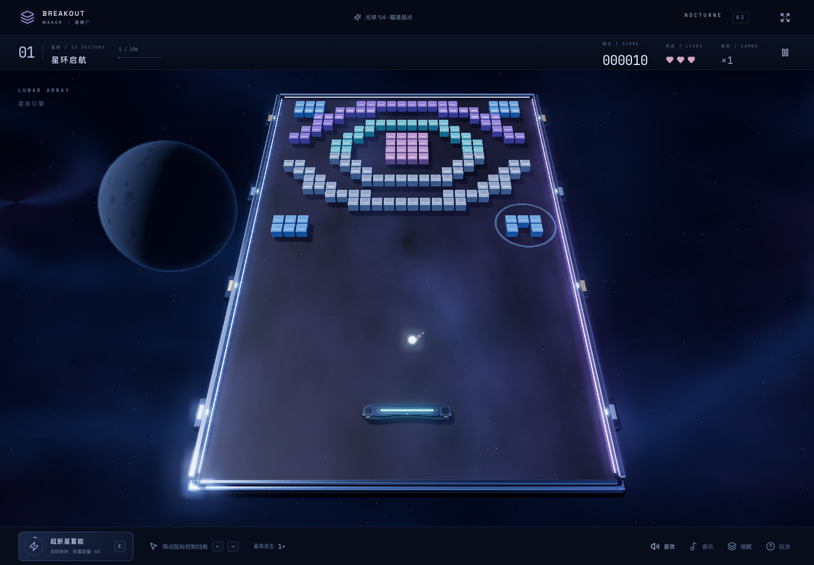
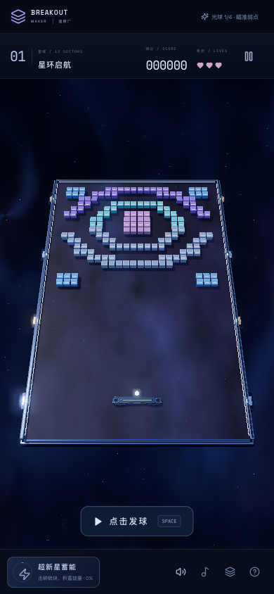

# Breakout Maker · 造砖厂

**NOCTURNE · 星夜引擎 — a lunar arcade for playing and making brick-breaker levels.**

[在线体验 · Play now](https://luyao.blog/games/breakout/) · [对比视频 · Video](media/promo/README.md) · [部署与回滚 · Deployment](deploy/COHOST.md) · [历史版本 · Archive](archive/README.md)

[简体中文](#简体中文) | [English](#english)



## 简体中文

### 当前版本

在月光与星云中的立体球场里打砖块，也可以把自己的图片或一句描述变成关卡。当前维护版本是 **NOCTURNE**：React 19、TypeScript、Three.js 与 React Three Fiber 构建界面和 3D 场景，共享游戏引擎负责平面碰撞、计分和道具。

- **星夜球场**：居中对称的固定透视镜头、深蓝晶体场地、月球与金属护栏；游玩时镜头不随碰撞晃动。
- **机械挡板**：分层金属外壳与发光能量核心，鼠标和触屏平滑跟随，键盘直接控制。显示位置与碰撞位置一致。
- **13 关全部开放**：前 12 关围绕入口、装甲、反应芯和加速砖设计；第 13 关保留原始「鹿原加油 / 必胜」文字彩蛋。关卡详情见 [星图说明](levels/README.md)。
- **清晰的游玩界面**：拾取、连击和道具倒计时显示在顶部，技能与音画控制放在底部。支持手机竖屏、细腻 / 流畅画质及减少动态效果偏好；WebGL 不可用时使用 Canvas 兼容画面。
- **空间音效**：击球、碎砖、道具和技能拥有独立反馈；背景音乐默认关闭，可自行开启。暂停或切到后台会冻结游戏并停止声音。



### 三种模式

| 模式 | 玩法 |
| --- | --- |
| 关卡模式 | 任意选择 13 个内置关卡，清除砖块后继续下一关 |
| 图片模式 | 上传 JPG、PNG、WebP 或 GIF（最多 10 MB），预览砖阵后开玩；图片仅在浏览器本地处理 |
| 创造模式 | 输入 1–140 字的图案描述，由服务端模板或 AI 生图生成可玩的砖阵；需要启动 AI 服务 |

### 操作与道具

| 操作 | 鼠标 / 触屏 | 键盘 |
| --- | --- | --- |
| 移动挡板 | 在球场内移动鼠标或拖动手指 | `←` / `→` 或 `A` / `D` |
| 发球 | 点击发球按钮或球场 | `Space` |
| 暂停 / 继续 | 点击暂停或继续按钮 | `Esc` / `P`；暂停时也可按 `Space` 继续 |
| 超新星 | 能量满格后点击底部技能按钮 | `E` |

自然击碎砖块和命中装甲积蓄能量。**超新星**朝挡板上方的外层砖阵释放，最多直接命中 5 块砖、各造成 1 点伤害；直接击破反应芯还会伤害周围八格，冲击不连锁。技能伤害不回充能量，也不附赠火球。

| 道具 | 当前效果 |
| --- | --- |
| 分裂 / 齐射 | 各增加两颗普通球，全场最多 4 球 |
| 火球 | 强化一颗球，持续 4 秒或 6 次碰砖；装甲仍会反弹火球 |
| 加宽 | 挡板加宽 25%，持续 7 秒 |
| 生命修复 | 每局最多补回一次失去的生命，不超过初始生命数 |

自然击碎砖块有 7% 概率掉落补给，连续 18 次未掉落触发保底，仍受 5 秒冷却和最多 2 个在场补给限制。连击计分倍率最高 4 倍；加速砖使撞击它的球逐步加速，最高为基础速度的 130%。

### 本地运行

推荐 **Node.js 22.12 或更新的 22.x 版本**。

```bash
npm ci
npm run dev
```

打开 [http://localhost:5173](http://localhost:5173)。内置关卡和图片模式无需 AI 服务。

```bash
npm run build       # 生成共享模块、类型检查并构建 dist/
npm run preview     # 预览构建，默认 http://localhost:4173
npm test            # 共享逻辑回归测试 + 现代版 Vitest 测试
npm run test:legacy  # 仅运行共享逻辑的旧测试集
npm run format:check
```

`dev`、`build` 和 `test` 会自动生成 `web/game/legacy.js`。修改共享规则请编辑 `src/`；关卡编辑见 [levels/README.md](levels/README.md)。修改这些输入后需重新运行命令，不要直接修改生成文件。

### AI 服务与体验额度（可选）

在第二个终端运行：

```bash
cd server
npm ci
cp .env.example .env
# 编辑 .env，配置 IMAGE_API_KEY 或 LLM_API_KEY
npm run dev
```

默认使用硅基流动 `Kwai-Kolors/Kolors`，API 监听 `3001`；Vite 开发服务器代理 `/api` 请求。完整环境变量、API 和存储说明见 [server/README.md](server/README.md)。

共享生成每个 IP **累计 3 次**，刷新或服务重启不会重置。请求被接受后即计次，模板命中和上游生成失败也计次；在额度预留前被拒绝的无效或繁忙请求不计次。

可以随时切换为自己的硅基流动 API Key，选择 Kolors 或 Qwen-Image，且不消耗共享次数。个人密钥保存在当前弹窗内存中，随生成请求经后端用于调用模型，不写入浏览器持久存储或服务端日志；关闭弹窗后不再保留。个人密钥失败时不会改用共享密钥。

### 部署

`dist/` 可部署到静态托管服务，启用创造模式时需代理 API。子路径部署需同时配置资源路径与 API 路由，例如：

```bash
VITE_BASE_PATH=/games/breakout/ npm run build -- --outDir dist-live
```

当前线上采用 **Nginx 静态资源 + 独立 Express API + 版本化发布目录**。发布、验证与回滚步骤见 [deploy/COHOST.md](deploy/COHOST.md)。

Docker 可在同一服务上提供前端和 API。先配置 `server/.env`，并挂载持久卷保存体验次数：

```bash
docker build -t breakout-maker .
docker run --rm --env-file server/.env \
  -e QUOTA_STORE_PATH=/app/server/data/trial-quota.json \
  -v breakout-maker-data:/app/server/data \
  -p 3001:3001 breakout-maker
```

访问 [http://localhost:3001](http://localhost:3001)。仓库中的 Compose 与旧部署脚本属于另一套独立部署方案；与线上共站环境的区别见部署文档。

### 项目结构与版本关系

```text
web/                       React 界面、Three.js 场景、现代游戏适配层
  components/LunarCourt.tsx 星夜球场
  components/LunarPaddle.tsx 机械挡板模型
  game/engine.ts           技能、掉落、输入平滑与运行时适配
  game/build-legacy.cjs    共享逻辑模块生成脚本
src/                       共享物理、实体、计分、道具与图片转换
levels/                    12 个战术关卡 + 1 个受保护的个人彩蛋
server/                    Express + TypeScript 生图与额度 API
test/                      共享逻辑测试与现代版回归测试
public/                    前端静态资源
deploy/                    部署配置和操作说明
media/promo/               已发布的版本对比视频
archive/                   历史版本源码索引
```

设计说明见 [.impeccable.md](.impeccable.md)、[视觉规范](web/design-notes.md) 和 [玩法体验规范](web/arcade-direction.md)。

`node build.js` 仍可生成旧界面的 `preview.html`，但会使用当前共享代码和关卡。需要重现历史 Canvas 2D 版本时，请使用 [归档标签](archive/README.md)。`src/` 和 `levels/` 都是当前版本的构建输入。

## English

### Current edition

Play brick-breaker on a three-dimensional court among moonlight and nebulae, or turn an image or a short description into a level. **NOCTURNE** is the current maintained edition, built with React 19, TypeScript, Three.js and React Three Fiber. A shared engine handles planar collisions, scoring and powers.

- **Lunar arena:** a centered, fixed perspective camera, crystalline court, moon and metal rails, with no impact-driven camera shake.
- **Mechanical paddle:** layered metal and a luminous core, smooth mouse/touch movement and direct keyboard control. Rendering and collision use the same position.
- **All 13 stages open:** twelve tactical layouts with entrances, armor, reactors and accelerators, plus the preserved “鹿原加油 / 必胜” dedication. See the [campaign guide](levels/README.md).
- **Clear play space:** pickup messages, combos and timers stay above the court; skill and audiovisual controls sit below it. Portrait layouts, high/low quality, reduced-motion support and a Canvas fallback keep the game usable across devices.
- **Spatial audio:** distinct ball, brick, pickup and skill sounds. Music is off by default. Pausing or leaving the active window freezes play and silences audio.

### Modes

| Mode | Experience |
| --- | --- |
| Campaign | Choose any of 13 stages and clear the bricks to continue |
| Image | Convert a JPG, PNG, WebP or GIF up to 10 MB into a playable brick preview, entirely in the browser |
| Create | Describe a pattern in 1–140 characters; the server uses a template or AI image generation to create a level |

### Controls and powers

| Action | Mouse / touch | Keyboard |
| --- | --- | --- |
| Move paddle | Move or drag across the court | `←` / `→` or `A` / `D` |
| Launch | Click the launch button or court | `Space` |
| Pause / resume | Use the pause or resume button | `Esc` / `P`; `Space` also resumes |
| Supernova | Tap the charged skill button below the court | `E` |

Natural brick kills and armor hits charge **Supernova**. It targets exposed bricks above the paddle, directly damaging up to five by one HP each. Destroying a reactor directly damages its eight neighboring cells without cascading. Skill damage neither recharges energy nor grants a fireball.

| Power | Current effect |
| --- | --- |
| Split / multishot | Each adds two ordinary balls, up to four on the field |
| Fireball | Strengthens one ball for four seconds or six brick contacts; armor still reflects it |
| Wide paddle | Adds 25% width for seven seconds |
| Life repair | Restores one lost life per run, capped at the starting life count |

Natural kills have a 7% drop chance and an 18-kill pity threshold, subject to a five-second cooldown and two active drops. Combo scoring caps at 4×. Accelerator bricks increase the striking ball's speed up to 130% of its base speed.

### Run locally

Recommended runtime: **Node.js 22.12 or a newer 22.x release**.

```bash
npm ci
npm run dev
```

Open [http://localhost:5173](http://localhost:5173). Campaign and image mode work without the AI server.

```bash
npm run build       # Generate shared module, type-check and build dist/
npm run preview     # Preview the build at http://localhost:4173
npm test            # Shared regression suite and modern Vitest tests
npm run test:legacy  # Shared legacy test suite only
npm run format:check
```

`dev`, `build` and `test` generate `web/game/legacy.js`. Edit `src/` for shared gameplay and follow [levels/README.md](levels/README.md) for campaign changes, then rerun the command. Do not edit the generated module.

### Optional AI server and trial allowance

Start a second terminal:

```bash
cd server
npm ci
cp .env.example .env
# Configure IMAGE_API_KEY or LLM_API_KEY in .env
npm run dev
```

The default provider is SiliconFlow with `Kwai-Kolors/Kolors`, listening on port `3001`. Vite proxies development `/api` requests. See [server/README.md](server/README.md) for environment variables, endpoints and storage.

Shared generation allows **three lifetime attempts per IP**, persisted across refreshes and service restarts. Accepted requests consume an attempt, including template hits and upstream failures. Invalid or busy requests rejected before quota reservation do not count.

Visitors can use a personal SiliconFlow API key at any time and select Kolors or Qwen-Image without consuming shared attempts. The key stays in the current dialog's memory and travels through the backend with the generation request to call the provider. It is not saved in browser storage or server logs, and closing the dialog discards it. Failed personal-key requests never fall back to the shared key.

### Deployment

Deploy `dist/` to a static host and proxy the API to enable Create mode. Subpath hosting requires matching asset and API routes, for example:

```bash
VITE_BASE_PATH=/games/breakout/ npm run build -- --outDir dist-live
```

The live installation uses **Nginx for static files, a separate Express API and versioned releases**. Follow [deploy/COHOST.md](deploy/COHOST.md) for deployment, checks and rollback.

Docker can serve both the frontend and API. Configure `server/.env` first and persist quota data in a named volume:

```bash
docker build -t breakout-maker .
docker run --rm --env-file server/.env \
  -e QUOTA_STORE_PATH=/app/server/data/trial-quota.json \
  -v breakout-maker-data:/app/server/data \
  -p 3001:3001 breakout-maker
```

Open [http://localhost:3001](http://localhost:3001). The existing Compose file and older deployment scripts describe a separate installation layout; see the deployment guide before using them.

### Architecture and history

`web/` owns React UI, the Three.js arena, procedural audio and the modern adapter. `src/` supplies shared physics, entities, scoring, powers and image conversion. `levels/` contains twelve tactical stages and the protected dedication; `server/` provides generation and quota APIs; `test/` covers shared logic and the modern edition. Deployment instructions live in `deploy/`, and the comparison video is in `media/promo/`.

Current design guidance lives in [.impeccable.md](.impeccable.md), the [visual contract](web/design-notes.md) and the [arcade experience notes](web/arcade-direction.md).

`node build.js` can still generate the legacy-interface `preview.html`, using today's shared source and levels. To reproduce the historical Canvas 2D release, use an [archive tag](archive/README.md). Both `src/` and `levels/` remain active build inputs.

## License

MIT
