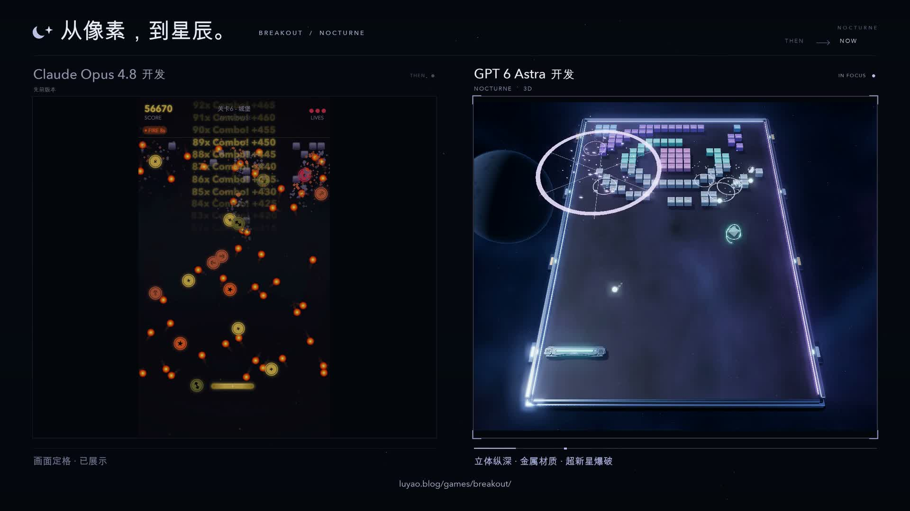

# 从像素，到星辰 · From pixels to starlight

[观看或下载 MP4 · Watch or download](breakout-before-after-1080p.mp4) — 20 秒 / seconds · 1920×1080 · 30 fps · H.264 / AAC stereo · 4.44 MB

| 片段 / Segment | 画面 / View | 标题 / Label | 版本 / Version |
| --- | --- | --- | --- |
| 0–10 秒 / seconds | 左侧旧版 / Legacy on the left | Claude Opus 4.8 开发 | [Canvas 2D · 326db4c](https://github.com/luyao618/breakout-maker/tree/archive/legacy-20260905) |
| 10–20 秒 / seconds | 右侧新版 / NOCTURNE on the right | GPT 6 Astra 开发 | [NOCTURNE 3D · 4e6e0aa](https://github.com/luyao618/breakout-maker/tree/4e6e0aa52c076f0e9d3876faa273203af29d650f) |

旧版取自最近两次重做之前的 Canvas 2D 归档，第六关「城堡」；新版取自线上 NOCTURNE 的第一关「星环启航」。两侧固定排列，前后各突出一段连续 10 秒的实玩。非播放侧以明确标注的预览或定格画面呈现。新版在成片约 12 秒和 19 秒各释放一次超新星。

通过自动挡板操作录制真实游戏，操作限于正常移动、发球和已蓄满能量的技能。画面保持正常速度和完整游戏画布，收录原生游戏音效，并加入自制的轻量氛围配乐。

The video compares the archived Canvas 2D castle stage with the live NOCTURNE star-ring stage. Each version gets ten seconds of continuous gameplay; the inactive side is explicitly labeled as a preview or held frame. The new version releases two earned Supernova pulses at approximately 12 and 19 seconds.

Both games were played with automated paddle control using ordinary movement, launch and earned-skill inputs. Footage runs at normal speed with each full game canvas visible. The soundtrack combines captured game effects with an original, quiet ambient bed.

[在线体验 · Play now](https://luyao.blog/games/breakout/) · [历史版本归档 · Version archive](../../archive/README.md)
